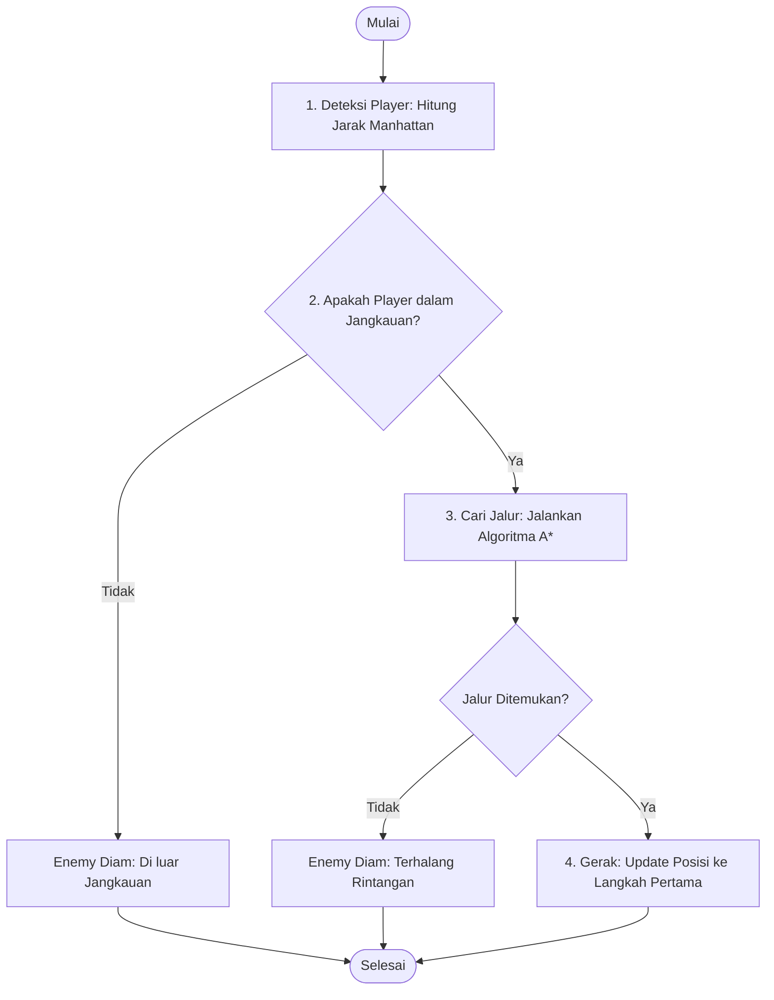

# Tugas AI Game: Pathfinding & Enemy Detection

**Identitas Mahasiswa:**
* **Nama:** Fahri Muhadjib Abiyu
* **NIM:** 20220801107
* **Mata Kuliah:** Game Development
* **Kelas:** KH001
* **Dosen:** Taufik Rendi Anggara, S.Si, M.T.

---

## 1. Identifikasi Algoritma

Untuk mengimplementasikan perilaku Enemy pada dungeon berbasis grid sesuai soal, digunakan kombinasi algoritma berikut:

1. **Deteksi Player & Jangkauan (Detection & Range Check):**
   * **Manhattan Distance**: Menghitung jarak petak lurus antara posisi Enemy (r1, c1) dan Player (r2, c2) tanpa rute diagonal.
     * Rumus: `Jarak = |r1 - r2| + |c1 - c2|`
   * **Kondisi:** Jika `Jarak <= Radius Jangkauan`, Enemy mulai mengejar. Jika tidak, Enemy tetap diam.

2. **Pencarian Jalur Menuju Player (Pathfinding):**
   * **Algoritma A* (A-Star)**: Algoritma pencarian rute terpendek terbaik untuk menghindari dinding/halangan di dungeon dengan fungsi evaluasi:
     * `f(n) = g(n) + h(n)`
     * `g(n)`: Jarak langkah aktual dari posisi Enemy ke petak n.
     * `h(n)`: Estimasi biaya heuristik (jarak Manhattan) dari petak n ke Player.

3. **Pergerakan (Movement):**
   * Mengambil simpul langkah pertama (`next step`) dari urutan jalur hasil A* dan memperbarui posisi koordinat Enemy ke petak tersebut.

---

## 2. Flowchart Sistem

Alur kerja logika Enemy (Deteksi -> Cek Jangkauan -> Cari Jalur A* -> Bergerak):



---

## 3. Implementasi Kode Program

### A. Program Java (`AStarDungeon.java`)

```java
import java.util.*;

public class AStarDungeon {
    static final int ROWS = 7;
    static final int COLS = 7;

    // 0 = Lantai, 1 = Tembok / Rintangan
    static int[][] map = {
        {0, 0, 0, 0, 0, 0, 0},
        {0, 1, 1, 1, 0, 1, 0},
        {0, 0, 0, 1, 0, 0, 0},
        {0, 1, 0, 0, 0, 1, 0},
        {0, 1, 1, 1, 1, 1, 0},
        {0, 0, 0, 0, 0, 0, 0},
        {0, 0, 0, 0, 0, 0, 0}
    };

    static class Node implements Comparable<Node> {
        int r, c;
        int g, h, f;
        Node parent;

        Node(int r, int c) {
            this.r = r;
            this.c = c;
        }

        @Override
        public int compareTo(Node o) {
            return Integer.compare(this.f, o.f);
        }
    }

    static int getManhattan(int r1, int c1, int r2, int c2) {
        return Math.abs(r1 - r2) + Math.abs(c1 - c2);
    }

    public static List<Node> findPath(int startR, int startC, int targetR, int targetC) {
        PriorityQueue<Node> openList = new PriorityQueue<>();
        boolean[][] visited = new boolean[ROWS][COLS];

        Node start = new Node(startR, startC);
        start.g = 0;
        start.h = getManhattan(startR, startC, targetR, targetC);
        start.f = start.g + start.h;
        openList.add(start);

        int[][] delta = {{-1, 0}, {1, 0}, {0, -1}, {0, 1}};

        while (!openList.isEmpty()) {
            Node current = openList.poll();

            if (current.r == targetR && current.c == targetC) {
                List<Node> path = new ArrayList<>();
                Node cur = current;
                while (cur != null) {
                    path.add(cur);
                    cur = cur.parent;
                }
                Collections.reverse(path);
                return path;
            }

            if (visited[current.r][current.c]) continue;
            visited[current.r][current.c] = true;

            for (int[] d : delta) {
                int nr = current.r + d[0];
                int nc = current.c + d[1];

                if (nr < 0 || nc < 0 || nr >= ROWS || nc >= COLS) continue;
                if (map[nr][nc] == 1 || visited[nr][nc]) continue;

                Node next = new Node(nr, nc);
                next.g = current.g + 1;
                next.h = getManhattan(nr, nc, targetR, targetC);
                next.f = next.g + next.h;
                next.parent = current;

                openList.add(next);
            }
        }
        return null;
    }

    public static void main(String[] args) {
        int enemyR = 0, enemyC = 0;
        int playerR = 5, playerC = 5;
        int radius = 10;

        int dist = getManhattan(enemyR, enemyC, playerR, playerC);
        System.out.println("Deteksi Jarak: " + dist);

        if (dist <= radius) {
            System.out.println("Status: Player Dalam Jangkauan! Mencari Jalur...");
            List<Node> path = findPath(enemyR, enemyC, playerR, playerC);
            if (path != null && path.size() > 1) {
                Node step = path.get(1);
                System.out.println("Enemy Melangkah ke Baris: " + step.r + ", Kolom: " + step.c);
            } else {
                System.out.println("Jalur Terblokir!");
            }
        } else {
            System.out.println("Status: Player di Luar Jangkauan.");
        }
    }
}
```

---
